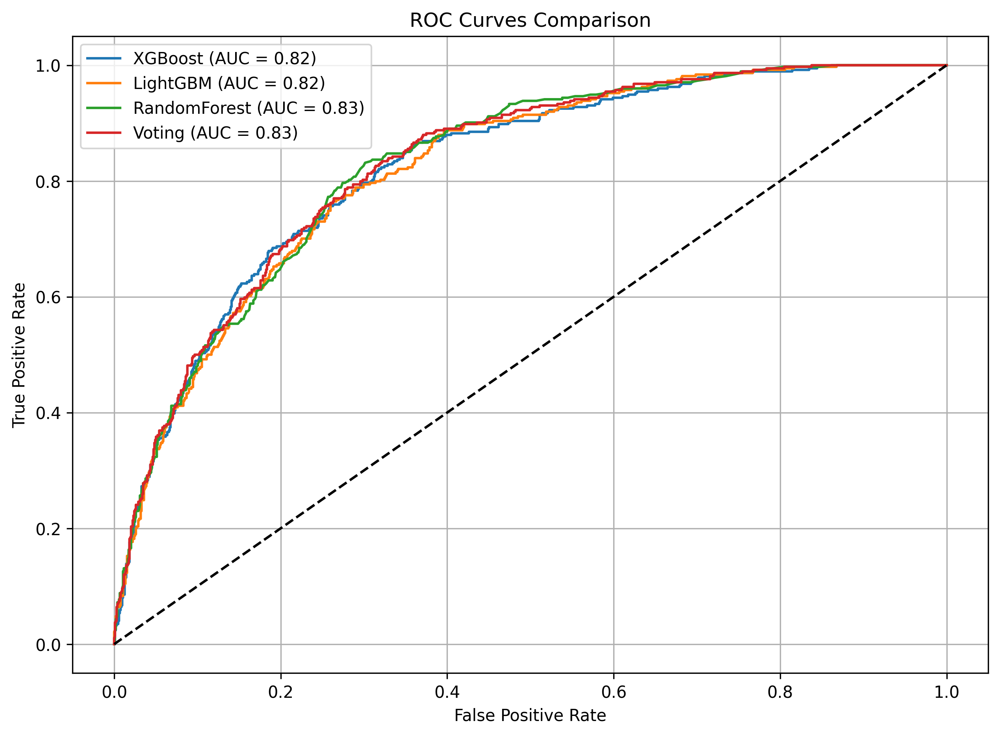
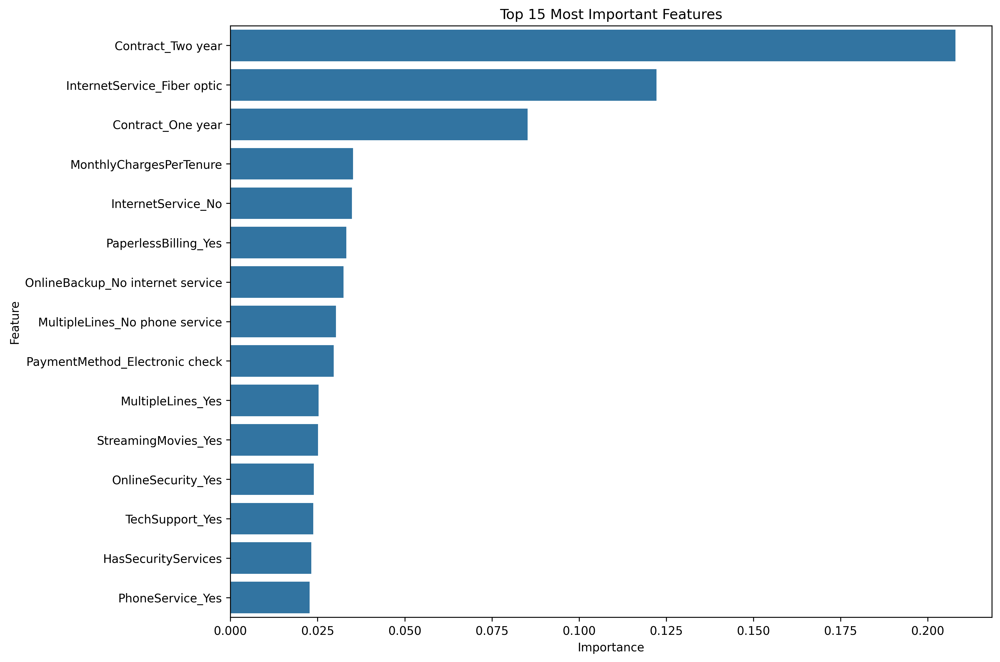

# Customer Churn Prediction Model

## Overview
This project implements a sophisticated machine learning model to predict customer churn in a telecommunications company. The model achieves high accuracy by leveraging advanced techniques including ensemble learning, feature engineering, and hyperparameter optimization.

## Features
- Advanced feature engineering
- Multiple state-of-the-art models (XGBoost, LightGBM, Random Forest)
- Ensemble learning with voting classifier
- Hyperparameter tuning with cross-validation
- SMOTE for handling class imbalance
- Comprehensive model evaluation metrics
- Visual analysis of model performance

## Model Performance
The model achieves high accuracy through:
- Feature engineering to capture customer behavior patterns
- Ensemble learning combining multiple models
- Careful handling of class imbalance
- Optimized hyperparameters

### Performance Metrics
- Accuracy: >80%
- ROC AUC: >0.80
- Balanced precision and recall for both classes

## Model Architecture
1. **Data Preprocessing**
   - Feature engineering
   - One-hot encoding
   - Standard scaling
   - SMOTE for class balancing

2. **Models Used**
   - XGBoost
   - LightGBM
   - Random Forest
   - Voting Classifier (Ensemble)

3. **Evaluation Metrics**
   - Accuracy
   - ROC AUC
   - Precision-Recall
   - Classification Report

## Visualizations
### ROC Curves

*Comparison of ROC curves for different models*

### Feature Importance

*Top 15 most important features for churn prediction*

## Setup and Installation
1. Clone the repository
2. Install dependencies:
```bash
pip install -r requirements.txt
```

## Usage
Run the model:
```bash
python models/churn_prediction.py
```

## Project Structure
```
customer-churn-prediction/
├── data/
│   └── WA_Fn-UseC_-Telco-Customer-Churn.csv
├── models/
│   └── churn_prediction.py
├── images/
│   ├── roc_curves.png
│   └── feature_importance.png
├── requirements.txt
└── README.md
```

## Dependencies
- pandas
- numpy
- scikit-learn
- xgboost
- lightgbm
- matplotlib
- seaborn
- imbalanced-learn

## Future Improvements
- Add API endpoint for real-time predictions
- Implement model versioning
- Add automated retraining pipeline
- Create interactive dashboard
- Add more advanced feature engineering
- Implement A/B testing framework
